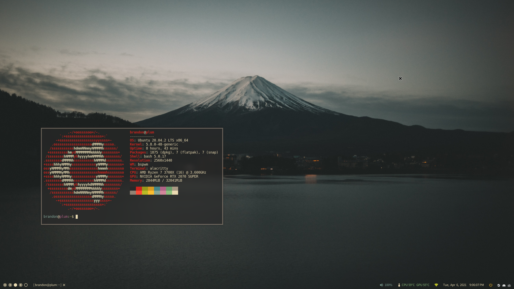

# .dotfiles
Configuration files for various programs.

## How to use/install
This repo is setup to use [GNU Stow](https://www.gnu.org/software/stow/) for creating symlinks for all the configuration files into your home directory. 

Clone into your home directory (or use Stow's `--target` flag from another location).
```
cd ~
git clone git@github.com:BrandonCardoso/.dotfiles.git
cd .dotfiles
```

Use `stow -v <folder>` to create symlinks to the configuration files in `<folder>`.

`stow -v --simulate <folder>` to preview the changes before applying.


## Preview
As of 2021-04-12

